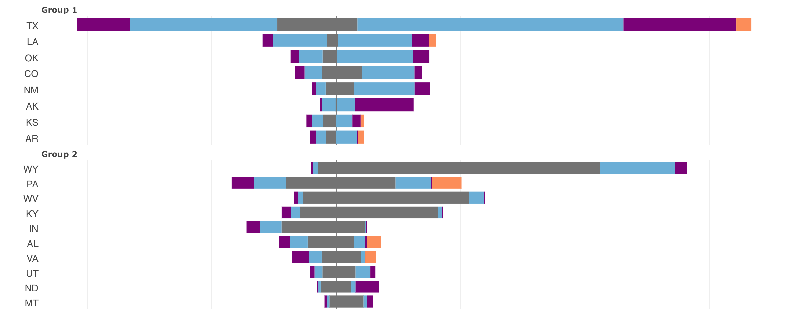
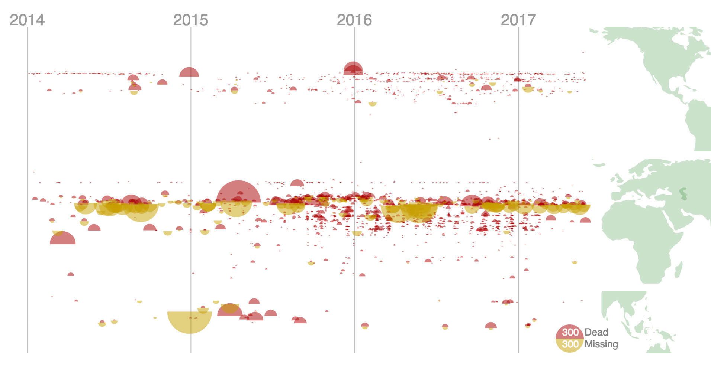
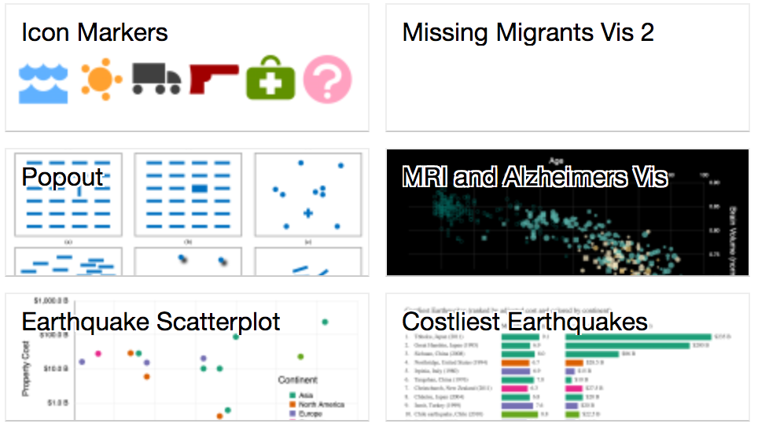

# David J. C. Beach

## Visualizations

### [The 50 States of US Energy](https://djbeach.shinyapps.io/usenergy/)

This project combines data from the [US Energy Information Administration (EIA)](https://www.eia.gov/) with other sources to give a dynamic picture of energy production and consumption across the 50 US States.  The data was combined and cleaned [using R](https://www.r-project.org/), and is dynamically displayed using R code with [plotly.js](https://plot.ly/javascript/).

### [Missing Migrants](https://bl.ocks.org/dbeach24/599725c960ce2881b1dcd46c3b20e268)

### [D3 Visualizations on Blocks.org](https://bl.ocks.org/dbeach24)

