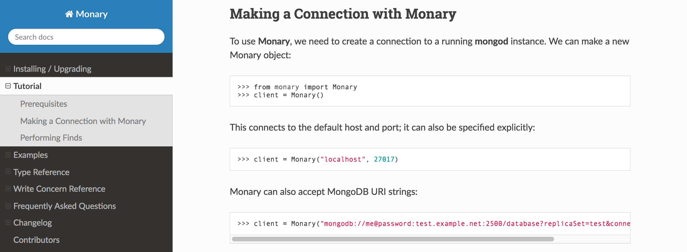
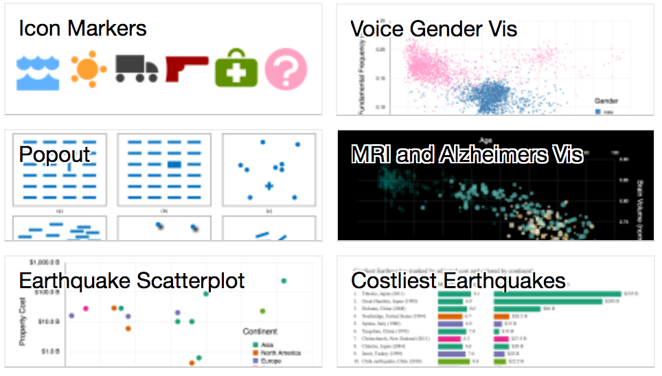

# David J. C. Beach

This web portfolio displays some of my recent work in Data Science and Data Visualization.

## Streaming t-SNE

<a href="https://github.com/dbeach24/StreamingTSNE" target="_blank">
  (link)   
</a>

[T-Distributed Stochastic Neighbor Embedding (t-SNE)](https://lvdmaaten.github.io/tsne/) is a widely used technique for embedding data of high dimension into a 2-D or 3-D space, while preserving local relationships in the original data.  Most implementations of this work employ batch processing to compute the 2-D embedding from a set of fixed, high-dimensional points.  [This project](https://github.com/dbeach24/StreamingTSNE) develops a streaming version of the algorithm, which creates and refines the embedding as data arrive.

## The 50 States of US Energy

<a href="https://djbeach.shinyapps.io/usenergy/" target="_blank">
  (link) 
</a>

This project combines data from the [US Energy Information Administration (EIA)](https://www.eia.gov/) with other sources to give a dynamic picture of energy production and consumption across the 50 US States.  The data was combined and cleaned [using R](https://www.r-project.org/), and is dynamically displayed using R code with [plotly.js](https://plot.ly/javascript/).

## Missing Migrants

<a href="https://bl.ocks.org/dbeach24/599725c960ce2881b1dcd46c3b20e268" target="_blank">
  (link) 
</a>

This dataset is from the [Missing Migrants](https://www.kaggle.com/jmataya/missingmigrants) data on Kaggle, and contains information about people who have gone missing while travelling along migration routes.  This data originates from the [Missing Migrants Project](https://missingmigrants.iom.int/).

## Monary

<a href="https://bitbucket.org/djcbeach/monary/wiki/Home" target="_blank">
  (link) 
</a>

[Monary](https://bitbucket.org/djcbeach/monary/wiki/Home) is an open source driver enabling
high performance queries for [MongoDB](https://www.mongodb.com/).

Monary was born out of a desire to improve query performance when accessing
[MongoDB](https://www.mongodb.com/) from dynamic languages like [Python](http://www.python.org),
in support of high-volume tasks such as data analytics.  It attracted internal
attention from MongoDB, Inc., and was enhanced by several MongoDB employees.  Browse
[the documentation](https://monary.readthedocs.io/).  Also see
[this presentation](https://www.youtube.com/watch?v=oteFpXIKBYg) by Kyle Suarez and Matt Cotter.

## D3 Visualizations on Blocks.org

<a href="https://bl.ocks.org/dbeach24" target="_blank">
  (link) 
</a>

Here's a sample of other visualizations I've created using `D3.js`.

